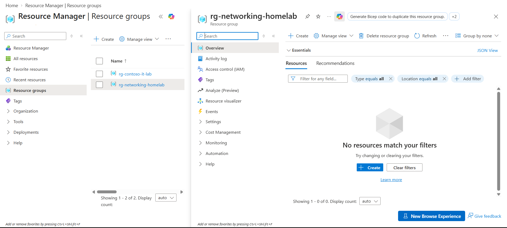
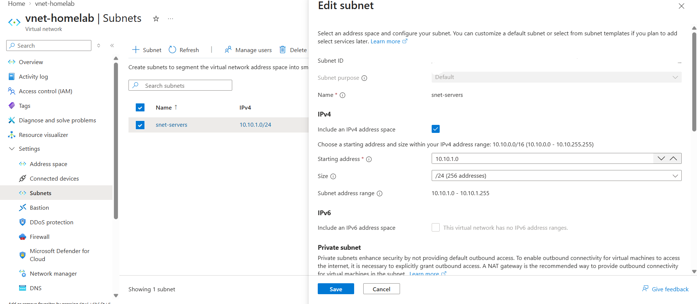
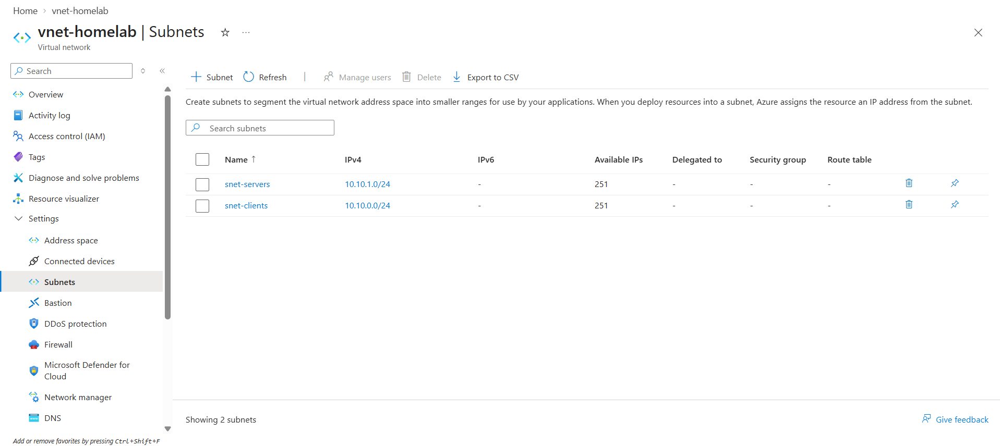
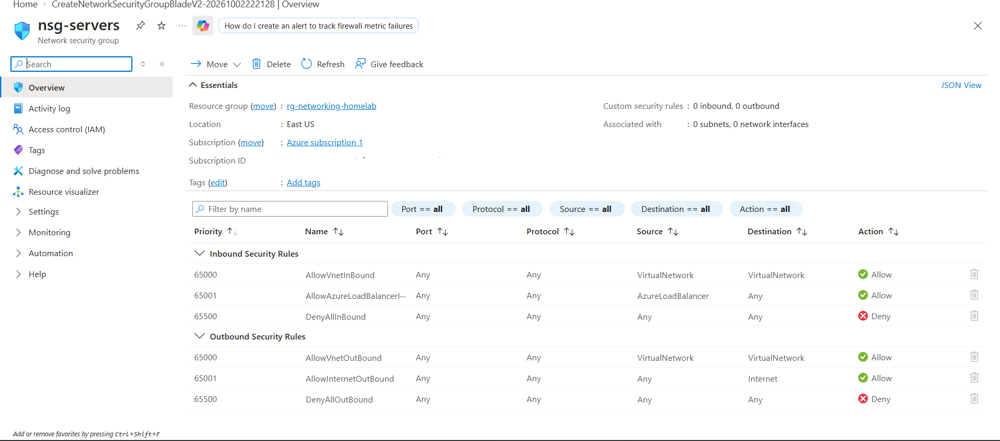
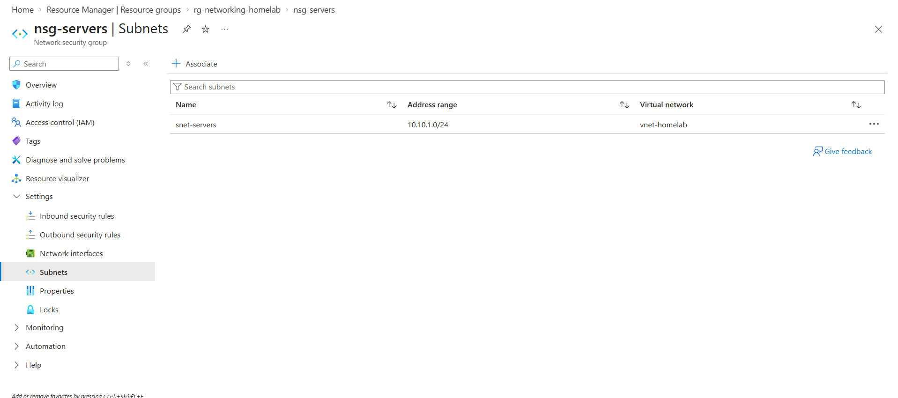
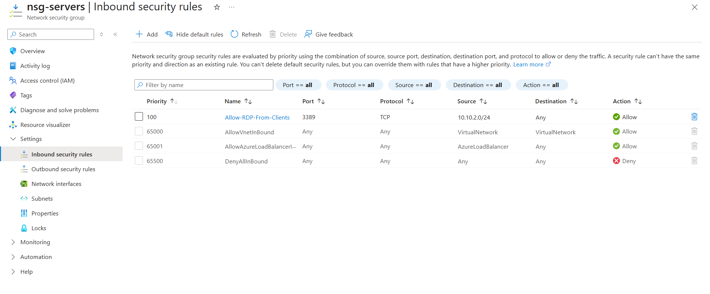
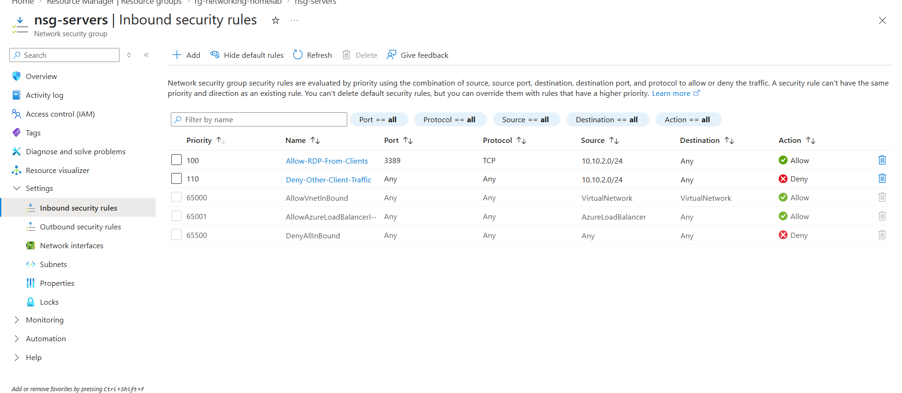
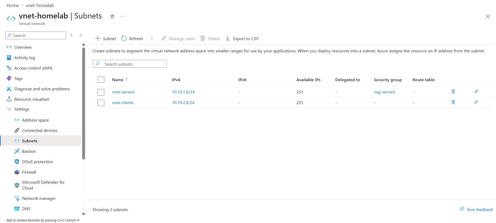

# Azure Virtual Network and Network Security Group Lab

## Objective

The objective of this lab was to gain hands-on experience with Azure networking by creating a virtual network, segmenting it into server and client subnets, creating a Network Security Group (NSG), and applying traffic filtering rules between subnets.

## Technologies Used

- Microsoft Azure
- Azure Virtual Network (VNet)
- Azure Subnets
- Network Security Groups (NSGs)
- Inbound Security Rules
- CIDR Addressing
- Network Segmentation
- GitHub

## Lab Environment

- Resource Group: `rg-networking-homelab`
- Virtual Network: `vnet-homelab`
- VNet Address Space: `10.10.0.0/16`
- Server Subnet: `snet-servers` - `10.10.1.0/24`
- Client Subnet: `snet-clients` - `10.10.2.0/24`
- Network Security Group: `nsg-servers`

## Implementation

### 1. Created the Networking Resource Group

Created a dedicated Azure resource group named `rg-networking-homelab` to organize the networking resources used in this lab.

### 2. Created the Virtual Network

Created a virtual network named `vnet-homelab` with the following address space:

- `10.10.0.0/16`

### 3. Created the Server Subnet

Created a server subnet named `snet-servers` with the address range:

- `10.10.1.0/24`

### 4. Created the Client Subnet

Created a client subnet named `snet-clients` with the address range:

- `10.10.2.0/24`

### 5. Created a Network Security Group

Created a Network Security Group named `nsg-servers`.

The NSG was associated with the `snet-servers` subnet so that inbound traffic to the server subnet could be controlled.

### 6. Allowed RDP from the Client Subnet

Created an inbound security rule with the following configuration:

- Source: `10.10.2.0/24`
- Protocol: TCP
- Destination Port: `3389`
- Action: Allow
- Priority: `100`
- Rule Name: `Allow-RDP-From-Clients`

This allows systems in the client subnet to initiate Remote Desktop connections to systems in the server subnet.

### 7. Blocked Other Client-to-Server Traffic

Created a second inbound security rule:

- Source: `10.10.2.0/24`
- Protocol: Any
- Destination Port: `*`
- Action: Deny
- Priority: `110`
- Rule Name: `Deny-Other-Client-Traffic`

Because the RDP allow rule has a lower priority number, Azure evaluates it first. Other traffic from the client subnet is denied by the second rule.

### 8. Verified Network Segmentation

Verified that:

- `snet-servers` uses `10.10.1.0/24`
- `snet-clients` uses `10.10.2.0/24`
- `nsg-servers` is associated with the server subnet
- RDP traffic from the client subnet is explicitly allowed
- Other client-to-server traffic is explicitly denied

## Verification

The final network configuration was verified by reviewing the virtual network and subnet configuration in the Azure portal.

The lab confirmed that:

- `vnet-homelab` uses the address space `10.10.0.0/16`
- `snet-servers` uses `10.10.1.0/24`
- `snet-clients` uses `10.10.2.0/24`
- `nsg-servers` is associated with the server subnet
- RDP traffic from the client subnet is allowed on TCP port `3389`
- Other traffic from the client subnet to the server subnet is denied

## Skills Demonstrated

- Azure Virtual Networks
- Subnet Design
- CIDR Addressing
- Network Security Groups
- Inbound Security Rules
- Network Segmentation
- Azure Resource Management
- Least-Privilege Network Access
- Azure Portal Administration
- Technical Documentation
- GitHub Project Documentation

## Lessons Learned

This lab reinforced how Azure virtual networks and subnets are used to separate systems into logical network segments.

I learned how Network Security Groups can control traffic at the subnet level and how rule priority affects which traffic is allowed or denied.

I also gained additional practice with CIDR notation and designing address ranges that do not overlap.

## Resume Project Bullet

- Built an Azure networking lab with a custom virtual network, segmented server and client subnets, subnet-level NSG protection, and priority-based inbound rules to allow RDP while denying other client-to-server traffic.

## Screenshots

### Networking Resource Group

### Server Subnet Created

### Two Subnets Created

### Network Security Group Created

### NSG Associated to Server Subnet

### RDP Security Rule

### Network Segmentation Rules

### Final Network Configuration

