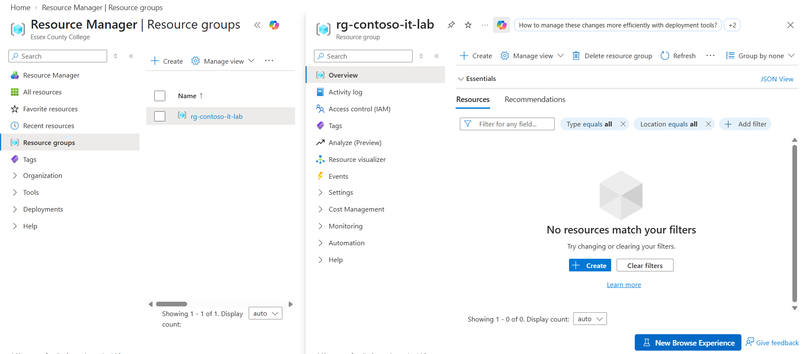
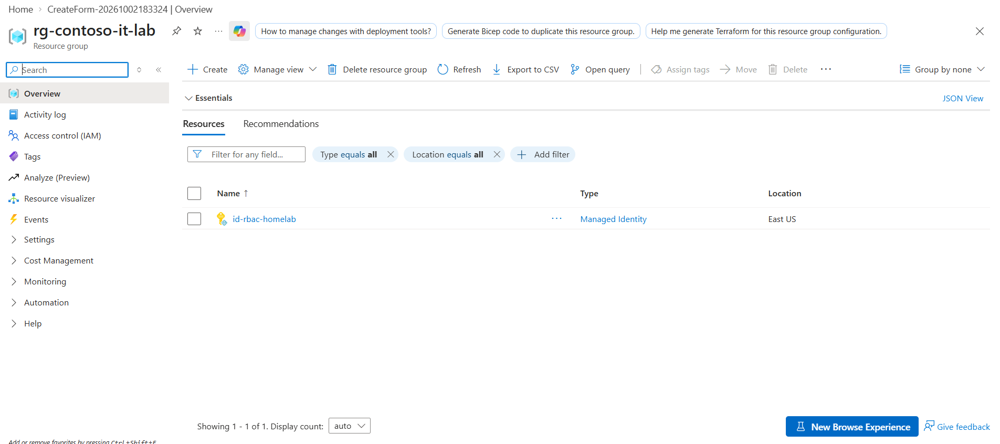
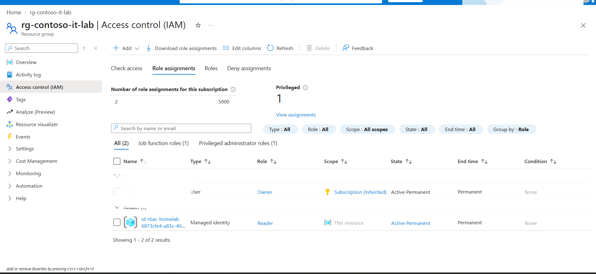
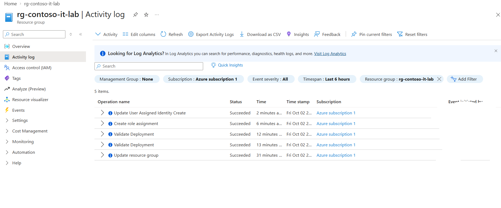

# Azure Role-Based Access Control (RBAC) Lab

## Objective

The objective of this lab was to gain hands-on experience with Microsoft Azure Role-Based Access Control (RBAC) by creating a resource group, deploying a user-assigned managed identity, and assigning least-privilege access at the resource-group scope.

## Technologies Used

- Microsoft Azure
- Azure Resource Groups
- Azure Role-Based Access Control (RBAC)
- Azure Managed Identities
- Azure Activity Log
- GitHub

## Lab Environment

- Resource Group: `rg-contoso-it-lab`
- Managed Identity: `id-rbac-homelab`
- RBAC Role: `Reader`
- Scope: Resource Group

## Screenshots

### Resource Group Created

### Managed Identity Created

### Reader Role Assigned

### RBAC Activity Log

