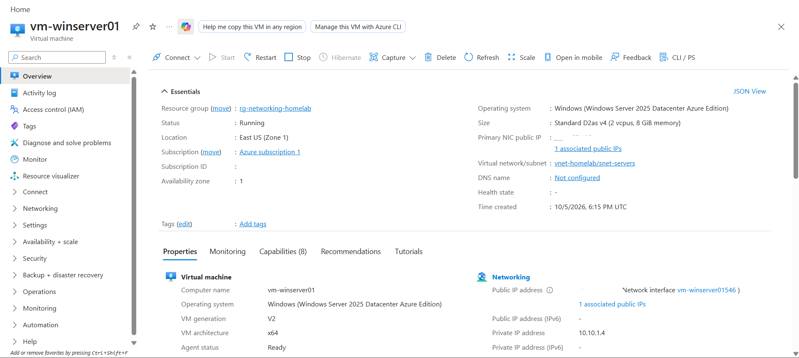
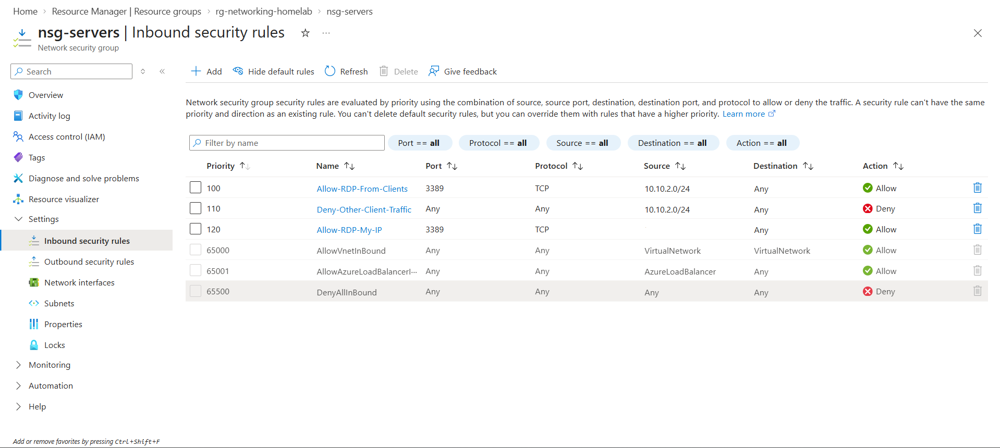
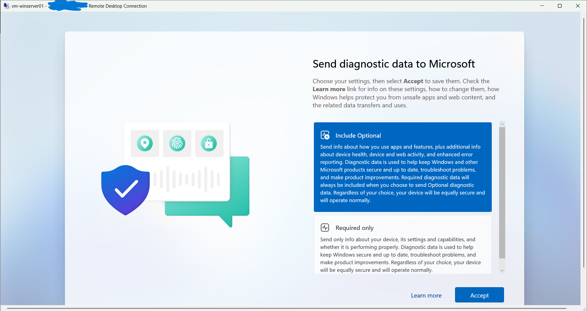
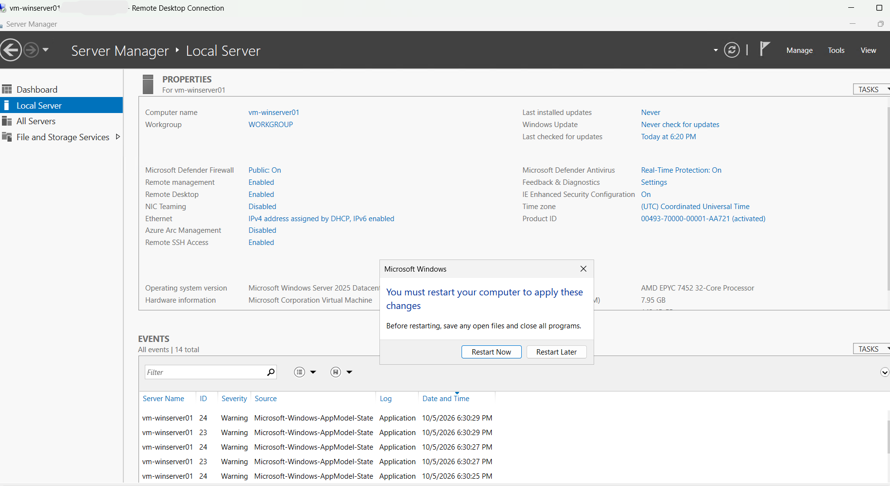
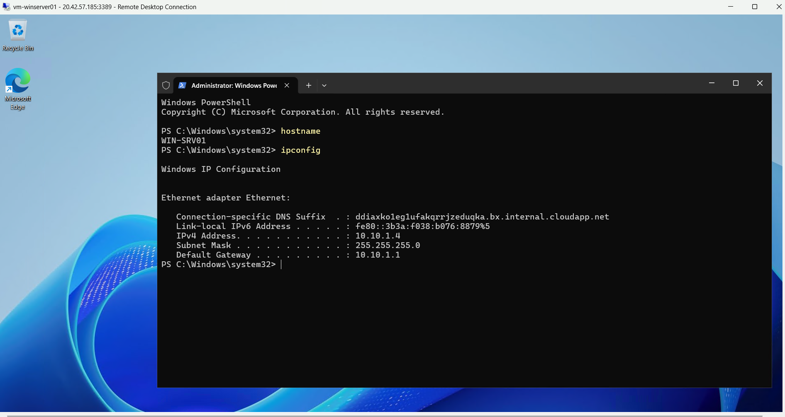
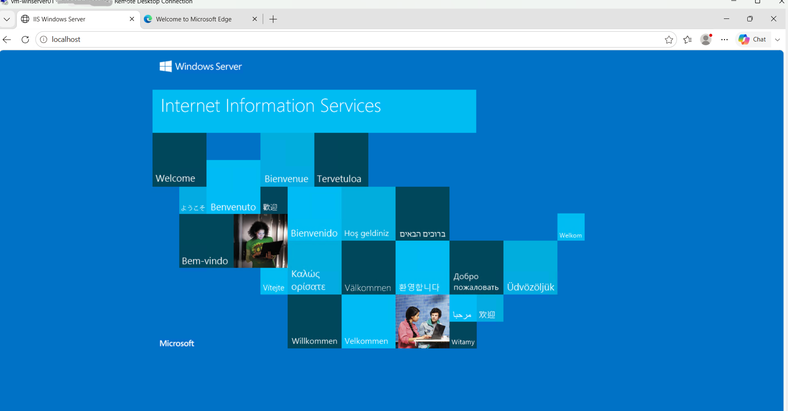
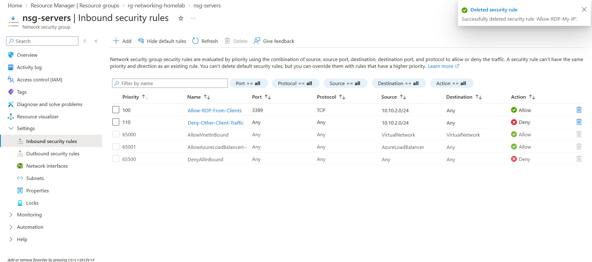
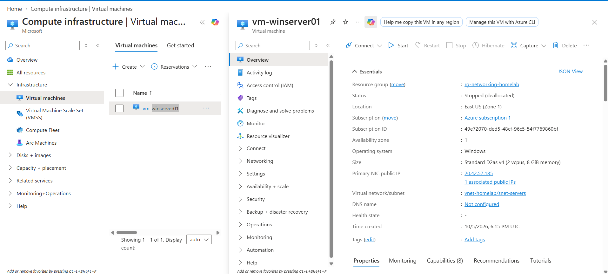

# Azure Windows Server Virtual Machine Lab

## Objective

The objective of this lab was to deploy and administer a Windows Server virtual machine in Microsoft Azure, connect it to an existing virtual network, securely access it using Remote Desktop, verify network configuration, install a server role, and properly clean up resources after use.

## Technologies Used

- Microsoft Azure
- Azure Virtual Machines
- Windows Server 2025
- Azure Virtual Network
- Azure Network Security Groups
- Remote Desktop Protocol (RDP)
- Windows Server Manager
- PowerShell
- Internet Information Services (IIS)
- GitHub

## Lab Environment

- Resource Group: `rg-networking-homelab`
- Virtual Machine: `vm-winserver01`
- Computer Name: `WIN-SRV01`
- Operating System: Windows Server 2025 Datacenter: Azure Edition
- VM Size: `Standard_D2as_v4`
- Virtual Network: `vnet-homelab`
- Subnet: `snet-servers`
- Server Subnet Range: `10.10.1.0/24`
- Network Security Group: `nsg-servers`

## Implementation

### 1. Deployed the Windows Server Virtual Machine

Created an Azure virtual machine named `vm-winserver01` using Windows Server 2025 Datacenter: Azure Edition.

The VM was deployed with the `Standard_D2as_v4` size.

### 2. Connected the VM to the Existing Network

Placed the VM inside the existing Azure networking environment:

- Virtual Network: `vnet-homelab`
- Subnet: `snet-servers`
- Subnet Range: `10.10.1.0/24`

The existing subnet-level Network Security Group, `nsg-servers`, continued to control inbound traffic.

### 3. Configured Temporary RDP Access

Created a temporary inbound NSG rule allowing TCP port `3389` only from my current public IP address.

This allowed secure Remote Desktop access without exposing RDP to the entire internet.

### 4. Connected to Windows Server with RDP

Connected to the Windows Server VM using Remote Desktop and the administrator account created during deployment.

### 5. Renamed the Server

Renamed the Windows Server computer to:

`WIN-SRV01`

The server was restarted to apply the hostname change.

### 6. Verified the Network Configuration

Used PowerShell commands including:

```powershell
hostname
`ipconfig`
````
## Verification

The Windows Server deployment was verified by reviewing both the Azure portal and the operating system configuration inside the virtual machine.

The lab confirmed that:

- `vm-winserver01` was successfully deployed in Azure
- The VM was connected to `vnet-homelab`
- The VM was placed in the `snet-servers` subnet
- Remote Desktop access worked using a temporary IP-restricted NSG rule
- The server hostname was changed to `WIN-SRV01`
- The VM received a private IP address from the `10.10.1.0/24` subnet
- IIS was successfully installed and the default web page loaded locally
- The temporary RDP rule was removed after administration
- The VM was stopped and deallocated after the lab

## Skills Demonstrated

- Azure Virtual Machine Deployment
- Windows Server Administration
- Azure Virtual Networking
- Network Security Groups
- Secure RDP Access
- Server Manager
- PowerShell
- Hostname Configuration
- IP Configuration Verification
- IIS Web Server Installation
- Azure Resource Cleanup
- Technical Documentation
- GitHub Project Documentation

## Lessons Learned

This lab reinforced how Azure virtual machines integrate with existing virtual networks and subnets.

I gained hands-on experience securing administrative access by limiting RDP to a specific public IP address instead of exposing port 3389 to the internet.

I also practiced basic Windows Server administration, including renaming a server, verifying network configuration with PowerShell, installing IIS, and confirming the web server was functioning correctly.

The lab also reinforced the importance of removing temporary access rules and deallocating virtual machines when they are not in use.

## Resume Project Bullet

- Deployed and administered a Windows Server 2025 VM in Azure, integrated it with a segmented virtual network, secured RDP access with NSG rules, verified networking with PowerShell, installed IIS, and deallocated resources after testing.

## Screenshots

### Windows Server VM Created



### Temporary RDP Rule Added



### Connected to Windows Server with RDP



### Server Manager - Local Server



### Server Network Verification



### IIS Web Server Installed



### Temporary RDP Rule Removed



### Virtual Machine Deallocated


